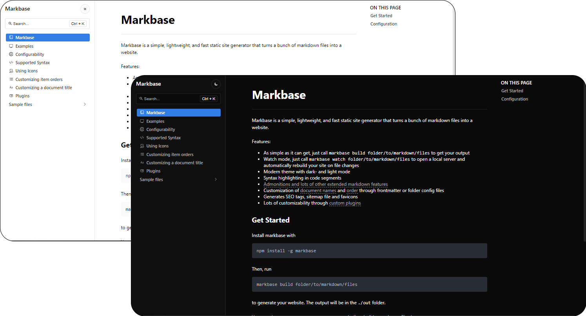

# Markbase

Markbase is a simple, lightweight, and fast static site generator that turns a bunch of markdown files into a website.



Features:
- As simple as it can get, just call `markbase build folder/to/markdown/files` to get your output
- Watch mode, just call `markbase watch folder/to/markdown/files` to open a local server and automatically rebuild your site on file changes
- Modern theme with dark- and light mode
- Syntax highlighting in code segments
- [Admonitions and lots of other extended markdown features](https://markbase.lukasbach.com/syntax/)
- Customization of [document names](https://markbase.lukasbach.com/title/) and [order](https://markbase.lukasbach.com/order/) through frontmatter or folder config files
- Generates SEO tags, sitemap file and favicons
- Lots of customizability through [custom plugins](https://markbase.lukasbach.com/plugins/)

## Get Started

Install markbase with

```bash
npm install -g markbase
```

Then, run

```bash
markbase build folder/to/markdown/files
```

to generate your website. The output will be in the `./out` folder.

You can also use `markbase watch` to automatically rebuild your site on file changes.

## Configuration

You can configure how markbase generates your site by creating a configuration file `config.yml` at the root of your
document folder:

```yaml
title: My Website
description: This is my website
documents: ["**/*.md"]
assets: ["**/*.png", "**/*.jpg"]
out: ./dist
```

See [here](https://markbase.lukasbach.com/config/) for more information on the configuration options.
